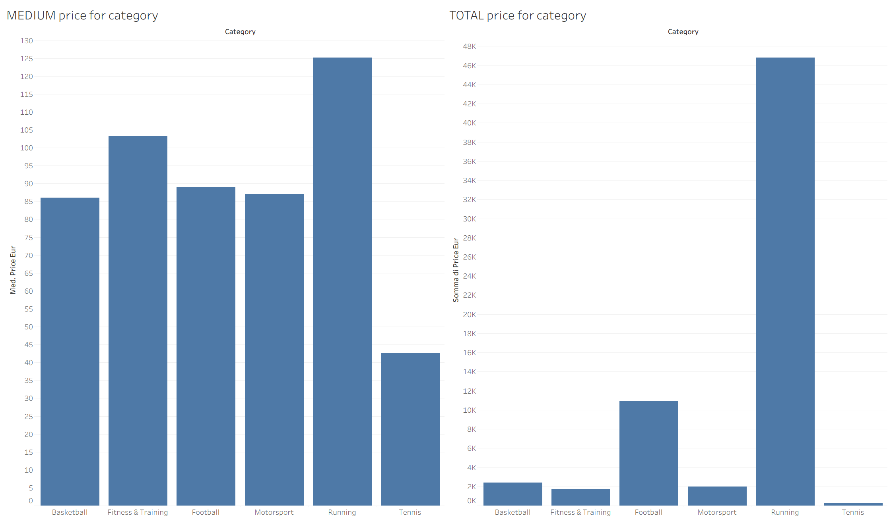
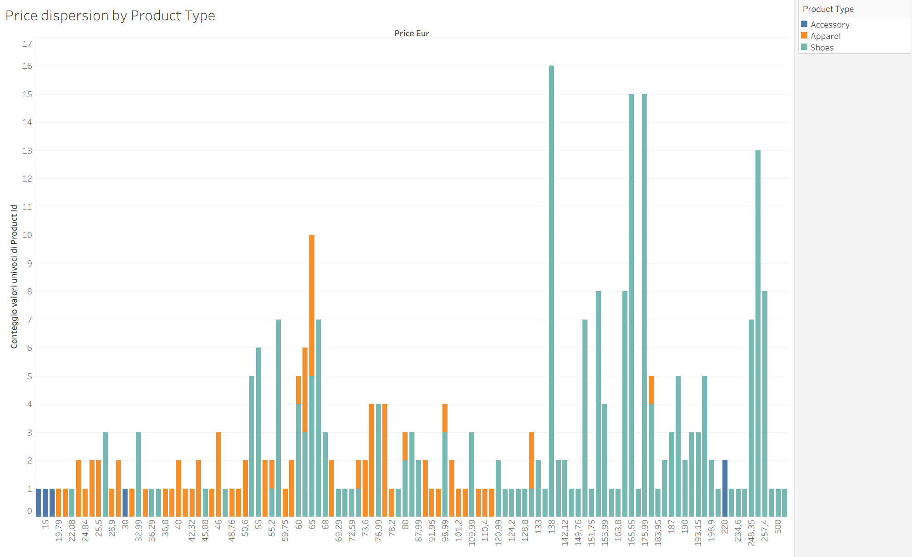
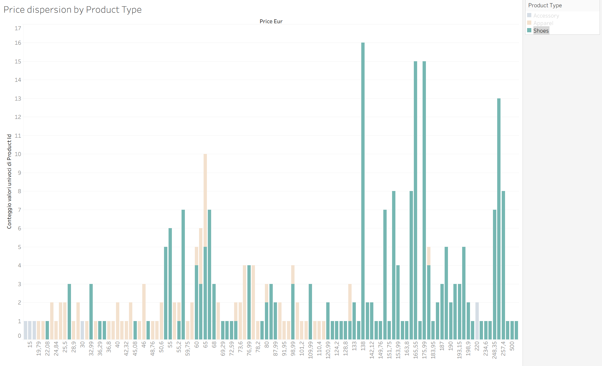
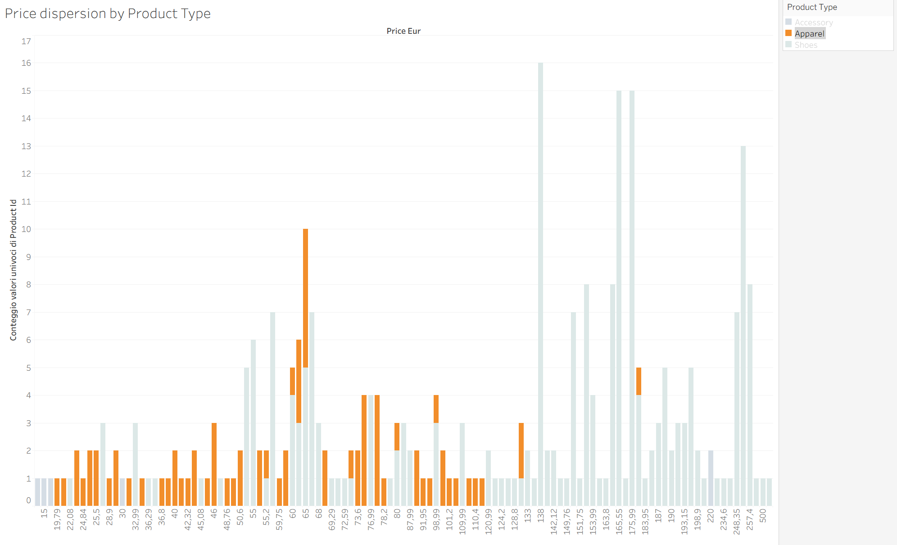
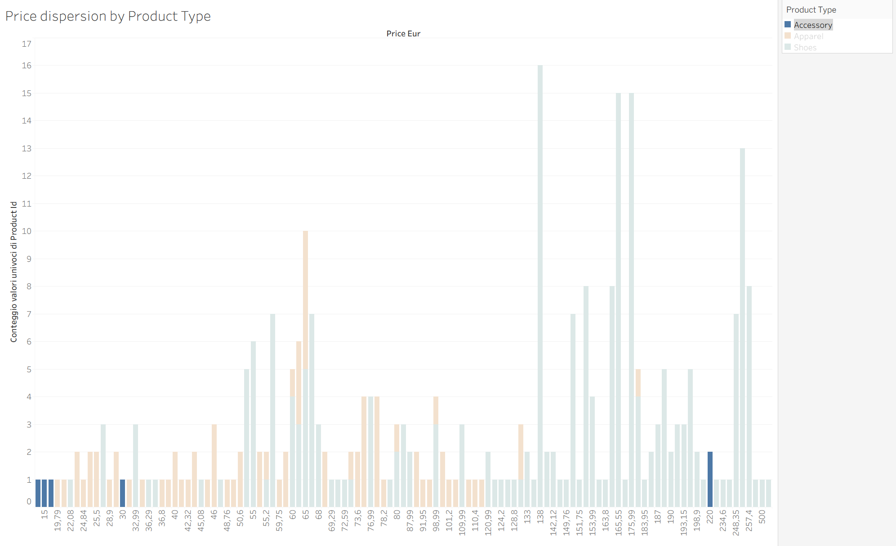
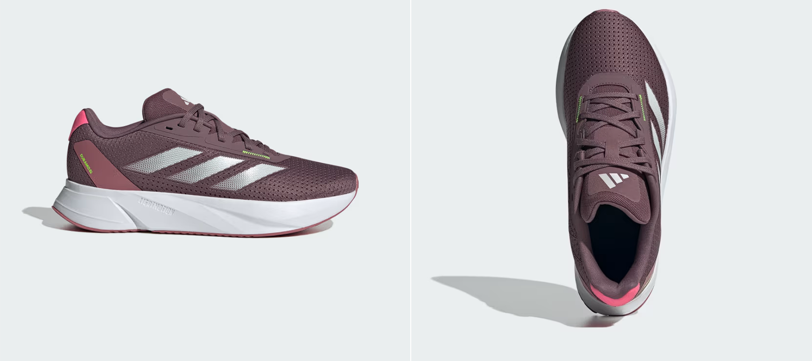
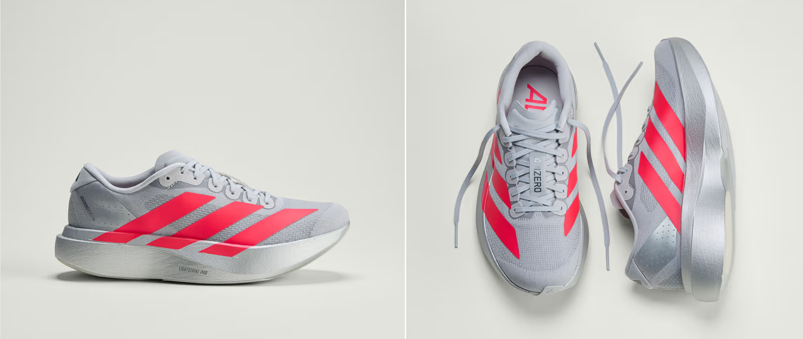

    
    <h1>Adidas Competitive Analysis</h1>
    <h3>Data Cleaning, SQL Analysis & Tableau Visualization</h3>
    <h4>Personal Portfolio Project</h4>

[Lorenzo Rizzo](https://github.com/BraHKet)

## Table of Contents

1. [Project Overview](#project-overview)
2. [The Business Question](#the-business-question)
3. [Dataset](#dataset)
4. [Methodology](#methodology)
5. [Key Findings](#key-findings)
6. [Conclusions](#conclusions--positioning-for-a-new-brand)
7. [Limitations](#limitations)
8. [Tools & Stack](#tools--stack)
9. [Author](#author)

---

## Project Overview

This is a **personal portfolio project** simulating a real-world scenario in which a sportswear company wants to understand how Adidas positions itself in the market before entering the Running segment.

The analysis covers the full data pipeline: raw CSV ingestion into MySQL, SQL-based cleaning and transformation, AI-assisted feature engineering, and interactive visualization in Tableau.

The dataset used is a global Adidas product catalog containing pricing, availability, and product information across multiple countries and currencies.

---

## The Business Question

> *A new sportswear brand wants to enter the running segment. How is Adidas currently positioned, and where is there room for a new entrant?*

Rather than starting with predefined hypotheses, this project follows an **exploratory approach**, the data guides the questions, and insights emerge progressively at each stage of the analysis.

---

## Dataset

The raw dataset `Adidas_Global.csv` contains product and pricing information for Adidas items across multiple countries and currencies.

- **44,888 records**
- **20 features** including product name, category, subcategory, gender segment, local price, currency, discount, and availability
- Data covers multiple markets: US, EU, Brazil, India, Japan, Korea, China, Mexico, and more

---

## Methodology

### 1. Data Ingestion
The raw CSV was loaded into a **MySQL database** using Python, enabling structured querying rather than working directly on the file.

### 2. Data Cleaning (SQL)
A SQL query was written to:
- **Deduplicate** records using `MIN(price_local)` and `GROUP BY product_id`
- **Convert all prices to EUR** using a `CASE` statement with fixed exchange rates (USD, GBP, BRL, CNY, INR, JPY, KRW, MXN)
- **Handle NULL discounts** with `COALESCE(MAX(discount_pct), 0)`
- **Filter** only products with a valid subcategory and relevant sport categories

### 3. Feature Engineering (AI-assisted)
Since product names appear in **10+ languages** (English, French, Spanish, Portuguese, German, Japanese, Korean, Chinese), a rule-based `product_type` classification was generated with the help of **Claude AI**.

The AI analyzed all unique product names and produced a multilingual keyword-matching SQL query that classifies each product into:
- **Shoes** — running footwear across all languages
- **Apparel** — jackets, shorts, leggings, t-shirts, etc.
- **Accessory** — socks, caps, sunglasses

Products in non-Latin scripts were classified like "Others".

### 4. Visualization (Tableau)
The cleaned datasets were loaded into **Tableau Public** for interactive visualization and storytelling.

---

## Key Findings

### Running dominates Adidas' catalog
Running is by far the largest category in Adidas' product catalog, both by number of products and total price volume. This makes it the most relevant segment to analyze for a brand looking to compete with Adidas.

  

### Adidas follows a two-tier pricing strategy in Running
Breaking down the price distribution by product type reveals a clear pattern:

  

**Footwear (22€ – 500€)**
- **Entry-level tier (~65-76€)**: basic running shoes for everyday training (e.g. Duramo SL)
- **Premium tier (~138-150€)**: high-performance shoes with advanced technology for experienced runners (e.g. Adistar with REPETITOR cushioning)

  

**Apparel (15€ – 100€)**
Adidas positions its Running apparel in a low-to-mid price range. Shorts, t-shirts, leggings and jackets are treated as a complementary, accessible product line rather than a premium offering.

  

**Accessories**
Marginal presence in the catalog — socks, caps, and sunglasses with very limited price range.

  

To validate the two price tiers identified above, here are real product examples 
retrieved directly from the dataset for each range:

  
  
<em>Entry-level tier (~65-76€)</em>

  
  
<em>Premium tier (~138-150€)</em>

---

## Conclusions — Positioning for a New Brand

Competing directly with Adidas in Running footwear would be extremely difficult. Adidas has dominant market presence, strong brand recognition, and established proprietary technology platforms (Boost, Repetitor, Lightstrike) that are hard to replicate for a new entrant.

Two alternative positioning strategies emerge from this analysis:

**Option 1 — Premium Accessories**
Adidas almost completely ignores accessories in Running. A new brand could own this space with high-quality, high-price running accessories (advanced GPS watches, premium hydration gear, performance eyewear), a segment where Adidas has no real presence.

**Option 2 — Premium Apparel**
Adidas positions its Running apparel in the low-to-mid price range (15€–100€). A new brand could differentiate by offering premium technical running apparel at a higher price point (100€–200€), targeting serious runners who are willing to pay for quality in clothing as much as in footwear.

Both strategies avoid direct competition with Adidas' strongest asset, its footwear, and instead target segments where the brand is either absent or underinvested.

---

## Limitations

- Exchange rates used for currency conversion are fixed and approximate
- The dataset represents a snapshot of the Adidas catalog at a specific point in time
- Sample size for the Running category (~350 unique products) limits the statistical significance of distribution observations
- This analysis is based solely on Adidas' product catalog, it does not include competitor data, consumer demand data, or market size estimates

---

## Tools & Stack

| Tool | Purpose |
|------|---------|
| Python + pandas | Data ingestion and exploration |
| MySQL / MariaDB | Data cleaning and transformation |
| Beekeeper Studio | SQL query editor |
| Claude AI | Multilingual feature engineering |
| Tableau Public | Interactive visualization |
| Jupyter Notebook | Analysis documentation |

---

## Author

**Lorenzo Rizzo** — [GitHub](https://github.com/BraHKet)

*This is a personal project built for learning and portfolio purposes.*
